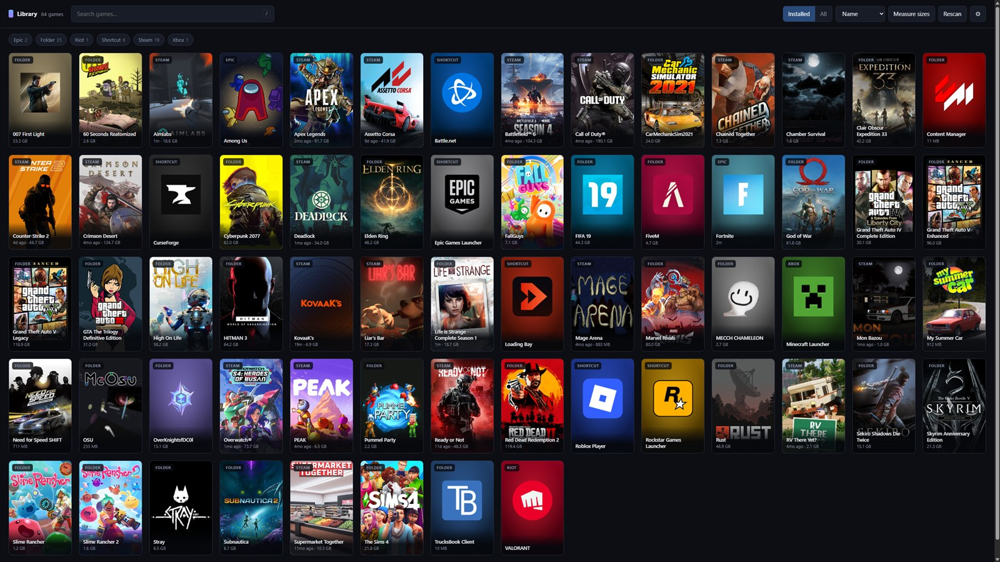
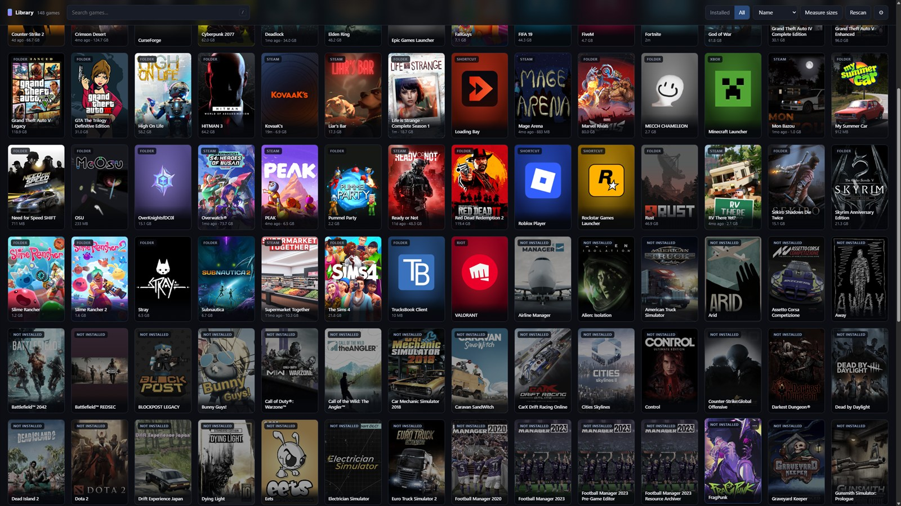
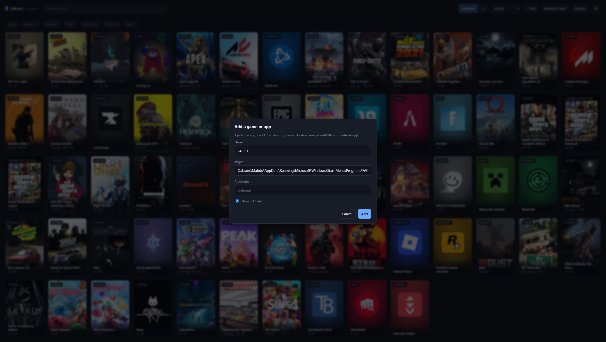
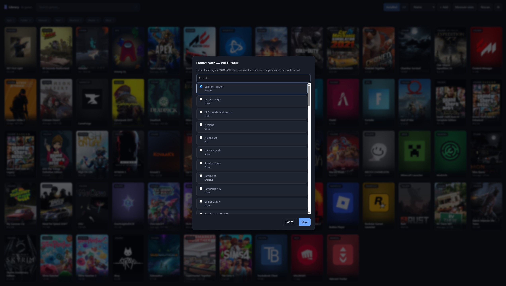
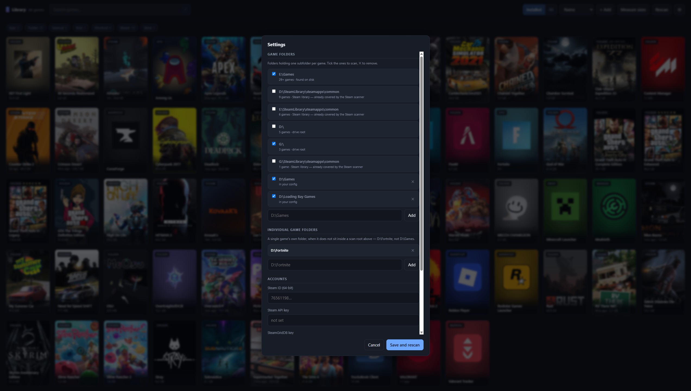

# Game Dashboard

One place to see and launch every game on a Windows PC — Steam, Epic, Xbox, Riot, and the
loose folders that belong to no launcher at all — with real cover art for all of them.

**Pure Python 3 standard library.** No pip install, no npm, no build step, no service in
the cloud. It runs a small HTTP server on `127.0.0.1` and opens a browser window at it.



## Quick start

```bat
git clone https://github.com/Abdulla1x/game-dashboard.git
cd game-dashboard
py install.py
```

`install.py` renders the icon and creates two Start Menu shortcuts:

| Shortcut | Where | What it does |
| --- | --- | --- |
| **Game Dashboard** | Start Menu | Opens the window. **Pin this one to the taskbar.** |
| Game Dashboard Server | Start Menu ▸ Startup | Runs the server headless at login |

Start it without rebooting:

```bat
cd /d C:\path\to\game-dashboard
start "" pythonw dashboard.pyw
```

Steam, Epic, Xbox and Riot are found automatically. Loose game folders need pointing at
once — open **⚙ Settings**, tick the folders it detected, and save. To see what it would
find before installing anything:

```bat
py detect.py
```

**Requirements:** Windows 10 or 11, Python 3.8+, and PowerShell (used for Start Menu
shortcut targets, Xbox app IDs, and icon rendering). That is all.

## Using it

- **Click a cover** to launch.
- **Installed / All** switches between what is on this PC and your whole library. Games
  you own but have not installed appear dimmed under **All**; clicking one hands the
  download to its launcher.
- **`/`** focuses search. Type to filter instantly.
- **Source chips** filter by Steam / Epic / folder / etc. **Sort** by name, last played,
  playtime, or size on disk.
- **Right-click a cover** for: Open folder, Launch with…, Rename, Pick executable,
  Fix cover art, Hide. Apps you added yourself get Edit and Remove too.
- **+ Add** puts anything else in the library — see below.
- **Rescan** picks up newly installed games. **Measure sizes** walks folder games to fill
  in size on disk — slow, so it runs in the background and is never automatic.

Switching to **All** brings in everything you own but have not installed, dimmed beside
what is on disk. Clicking one hands the download to its launcher.



### Adding something the scanners cannot see

**+ Add** takes a name and a target: a path to a `.exe`, a `.lnk` or `.url` shortcut, or a
link like `steam://rungameid/570` or `https://tracker.gg/…`. Arguments are optional, and
unticking **Show in library** keeps it out of the grid — which is what you want for a
helper you only ever launch alongside something else.

That covers the things no scanner will ever reach: a launcher living in `%LOCALAPPDATA%`,
one game inside a bundle folder where only the other was detected, or a tracker the Start
Menu scanner deliberately filters out.



A `.lnk` is resolved as you add it — **target, arguments and icon**. That matters more
than it sounds: a launcher-hosted app puts its identity in the arguments and ships its
artwork as a loose `.ico`, so Overwolf's Valorant Tracker shortcut is
`OverwolfLauncher.exe -launchapp <id>` with its own icon file. Read only the target and
you get plain Overwolf, wearing the Overwolf logo. Anything you type in **Arguments** is
appended to whatever the shortcut already carried.

### Launching more than one thing

**Right-click ▸ Launch with…** picks other entries to start alongside a game — a tracker
with Valorant, a mod launcher with Minecraft. The tile then reads `+1 app`, and one click
starts the lot.



The game starts first, and a companion that fails is reported rather than allowed to stop
it. Companions are one level deep: a companion's own companions are not launched, which is
what makes a loop impossible to build rather than merely unlikely.

## How it finds things

| Source | Method |
| --- | --- |
| Steam | `libraryfolders.vdf` → each library's `appmanifest_*.acf` |
| Epic | `%ProgramData%\Epic\EpicGamesLauncher\Data\Manifests\*.item` |
| Xbox | `XboxGames` matched to app IDs from `Get-StartApps` |
| Riot | `RiotClientServices.exe --launch-product=…` |
| Folders | your `scan_roots`, gated by the executable heuristic below |
| Shortcuts | Start Menu `.lnk`/`.url`, conservatively filtered, runs last |
| Steam (owned) | `GetOwnedGames` with an API key, else the appids Steam cached art for |
| Epic (owned) | the account's library service, after `py epicauth.py` |

### The executable heuristic

A folder counts as a game **only if a plausible executable is found in it**.
Redistributables, uninstallers, crash handlers and console tools are rejected by name and
by parent directory; survivors are scored on name similarity to the folder, then depth,
then size.

That gate is load-bearing rather than a nicety. Clip recorders like Medal and ReLive
create a folder named after every game you play, sitting right beside real installs and
containing nothing but video. Without the gate each one becomes a phantom game that
cannot be launched.

If nothing is found at depth 4, one deeper pass at depth 6 catches Unreal-style repacks
that bury the binary at `…\Gameface\Binaries\Win64\`.

### Cover art

1. Steam's own cache — including the newer hash-subdirectory layout
2. Steam's CDN by app ID
3. For non-Steam games: name → app ID via Steam's community search, then the CDN
4. SteamGridDB, if a key is set — this is what covers Epic and Riot titles, launchers and
   mod clients, which have no Steam app ID at all
5. A cover generated from the game's own artwork — the 256px icon inside the executable,
   the `.ico` a shortcut pointed at, or the tile art a Store package ships — centred on a
   gradient sampled from that icon
6. A generated lettered placeholder

Icons come out of the executable's PE resource directory rather than via PowerShell's
`ExtractAssociatedIcon`, which is capped at 32×32 and far too small to build a cover from.
Standalone `.ico` files are read the same way: the on-disk format is the same directory
the PE resource section keeps split apart, so a launcher-hosted app gets its *own*
artwork rather than its launcher's.

A bad name match is fixable: right-click → **Fix cover art** → set the Steam app ID.

## Configuration

Settings are written by the **⚙ Settings** panel; `config.json` is just where they land.
Copy `config.example.json` if you would rather write it by hand. It is gitignored.

Folders are detected rather than typed: it enumerates your drives, reads Steam's install
root from the registry, and counts how many subfolders of each candidate look like games.
Untick one to stop scanning it; **✕** removes the row outright, which is what you want for
a path that was a mistake rather than one you may re-enable. A detected folder that still
exists will be offered again next time either way.



### Games you do not own on Steam alone

**Steam.** A free key from [steamcommunity.com/dev/apikey](https://steamcommunity.com/dev/apikey)
plus your 64-bit SteamID gives the real owned library, and needs Steam privacy set to
**Game details: Public**. Without a key the library is inferred from the appids Steam has
cached artwork for, which works but drags in DLC and delisted apps — so every candidate is
checked against the store and the verdicts are cached.

**Epic.** Epic keeps no offline record of what you own, so it needs a one-time sign-in:

```bat
py epicauth.py
```

This uses Epic's launcher OAuth flow, which is unofficial and unsupported — it is the same
approach [legendary](https://github.com/derrod/legendary) and Heroic use. It is entirely
optional; skip it and the Epic side stays install-only. Tokens live in `data/epic_auth.json`
and refresh themselves.

**Everything else.** Xbox/Game Pass, Battle.net, Riot, Rockstar and EA expose no ownership
API that can be read without per-launcher OAuth, so they are listed by hand in
`data/overrides.json` under `owned_games`.

## Fixing what it gets wrong

Everything the UI writes lands in `data/overrides.json`, keyed by game id, and survives
rescans. You can also edit it directly:

```json
{
  "folder:D--Games--Some Game": { "exe": "Bin\\SomeGame.exe" },
  "folder:D--Games--UE_4.26":   { "hidden": true },
  "folder:D--Games--Stray":     { "steam_appid": 1332010 },
  "riot:valorant":              { "companions": ["manual:valorant-tracker"] },

  "extra_games": [
    { "id": "manual:example",
      "name": "A Game The Scanners Cannot See",
      "exe": "D:\\Games\\Bundle\\Sub Game\\Game.exe",
      "args": ["-windowed"] },
    { "id": "manual:valorant-tracker",
      "name": "Valorant Tracker",
      "url": "https://tracker.gg/valorant" }
  ]
}
```

An entry may also carry `icon`, a path to a `.ico` or a binary to take the cover from
when the launch target's own icon is the wrong one. **+ Add** fills it in from a shortcut.

`extra_games` is what **+ Add** writes, and it is still the place to add a title by hand —
useful for bundles where several games share one folder, so only one is detected
automatically. `exe` may be relative to the game's install folder or absolute, `args` is
optional, and `url` replaces `exe` for a protocol or web link. The id is generated from
the name when the entry is created and then frozen: renaming does not move it, so playtime
and cover art survive. Removing an entry and adding it again under the same name gets its
playtime back.

`companions` lists the ids of entries to launch alongside a game. A hand-written one may
name anything; the picker in the UI only offers what is installed.

## Playtime

Steam reports its own last-played time. For everything else the dashboard tracks its own:
after a launch it polls `tasklist` for the executable, opens a session on first sighting
and closes it when the process disappears. Sessions under 30 seconds are discarded.

Because tracking is keyed on the executable name, a game whose real binary differs from
the detected one will not be tracked — fix it with **Pick executable**. Companion apps are
deliberately not tracked: a helper left running all day would otherwise log a session
against itself, and against the game whenever the two share an executable name.

## Security

The server binds `127.0.0.1` only and has no authentication, because it can start
arbitrary executables. **Do not change the bind address and do not put it behind a tunnel.**

Loopback is not a boundary against your own browser, though: any page you have open can
send requests to `127.0.0.1`. So every request is checked for a matching `Host` header
(which blocks DNS rebinding), a same-origin `Origin` when one is present, and
`Content-Type: application/json` on POST — the last is what forces a CORS preflight that a
cross-origin page cannot pass. An executable *corrected* over HTTP must resolve inside
that game's own install folder, and cover art is verified by magic bytes rather than file
extension, so the art endpoint cannot be turned into a file reader.

Adding a game by hand is the one route that names a program the dashboard has never seen,
which is the entire point of the feature — so it is fenced rather than forbidden. The
target must already exist on disk and be a `.exe`, `.lnk` or `.url` outside the Windows
directory, or a link whose scheme is on a fixed list. That narrows what a bug in the
request guard would be worth. It is not itself the boundary; the guard is.

A hand-edited `data/overrides.json` is deliberately *not* subject to those limits: that
file is already trusted, and the constraint belongs at the HTTP boundary.

If you find something, please open an issue.

## Development

```bat
py -m unittest discover tests    :: portable; runs anywhere
py scan.py --selftest            :: structural invariants over your real library
py scan.py --dry-run -v          :: full table plus dedupe decisions, writes nothing
py detect.py                     :: what setup detection sees on this machine
```

Python changes need a server restart; `web/` is served from disk and only needs a reload.

```bat
cd /d C:\path\to\game-dashboard      :: pythonw has no console, so starting it from the
taskkill /F /IM pythonw.exe          :: wrong directory fails silently and looks like a
start "" pythonw dashboard.pyw       :: dead port
```

See [ARCHITECTURE.md](ARCHITECTURE.md) for how the pieces fit and which invariants matter,
and [CONTRIBUTING.md](CONTRIBUTING.md) before opening a PR.

## Layout

```
dashboard.pyw   entry point (pythonw: no console window)
install.py      icon + Start Menu shortcuts
detect.py       works out where this machine keeps its games
server.py       HTTP server, 127.0.0.1 only
scan.py         runs scanners, merges, dedupes, applies overrides
scanners/       steam, epic, xbox, riot, folders, shortcuts, owned_steam, owned_epic
exefind.py      the executable heuristic
art.py          cover art resolution
peicon.py       largest icon out of a PE binary, and PNG encode/decode
epicauth.py     one-time Epic sign-in
playtime.py     session tracking
vdf.py          Valve KeyValues parser
winpath.py      Windows/WSL path translation
winshell.py     PowerShell bridge
web/            index.html, app.js, style.css
tests/          unittest suite, no external dependencies
data/           generated: library.json, overrides.json, art/, tokens (gitignored)
```

## License

GPL-3.0. See [LICENSE](LICENSE).
